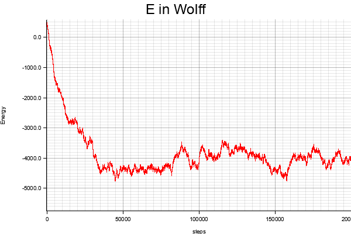
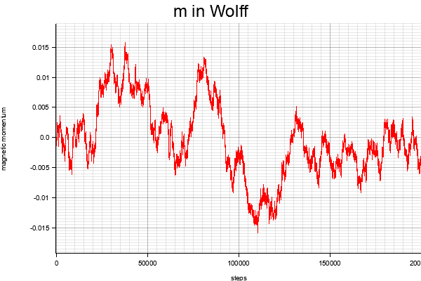

# Ising2D_Wolff

A simple 2D Ising model simulation program using Wolff algorithm.

To run this program:

        cargo run <size> <J> <beta> <steps>
  
 Results when `size = 200`, `J = 1`, `beta = 0.05`, `steps = 200000`:
 
 
 
 
