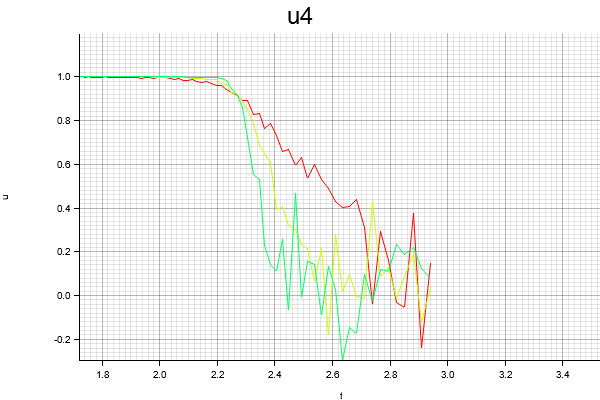

# Ising2D_Wolff

A simple 2D Ising model Monte Carlo simulation program using Wolff algorithm.

This was written by Peng as a class project for Thermodynamics and Statistcal Physics II at Fudan university 

This program does:

- Draws Binder cumulant curves which can be used to find the critical point of 2D Ising model
- Measures magnetic moments $M$ at different system sizes and temperatures. Draws points $(tL,ML^{1/8})$ , where $t=\frac{T-T_c}{T_c}$ is the reduced temperature and $L$ is the lattice length.

To run this program:

        cargo run <size> <J> <beta_start> <beta_end> <mc_times>
  
 Results when `size = 32`, `J = 1`, `beta_start = 0.34`, `beta_end = 0.7`, `mc_times = 100`:
 
 
 
 
